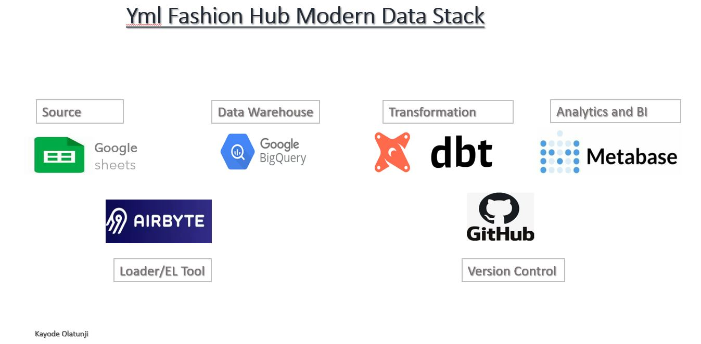

""
## This Project will document the steps involved in building the Analytics Engneering Workflow of YML Fashion. 

YML Fashion is a fashion company in the business of providing fashion designing services, textile sales and bespoke RTW Clothing collections.

The goal of this project is to build a Data Workflow that makes use of the Modern Data Stack and some best practices to deliver timely well curated data, easy to access documentation and trustworthy data for the bsuiness.
This can then feed into the stakeholder's Dashboard and associated Reports to deliver insights at thier fingertips. 

This is a somewhat basic to intermediate project. Fell free to follow along.

## Tools

1. Docker: This is the local version container that will house our Airbyte's Extract and Load solutions/App
2. Airbyte: The Open source version that we will use to extract and load data from source to destination
3. Google Sheets: This is our Data source which is also scrapped data from the web
4. Big Query: This is our Data warehouse and Destination 
5. dbt Cloud: This is our transformation, modelling and scheduling tool
6. Git and Github: This is our version control tool to enable collaboration and seamless CI[continuous Integration]
7. VS Code: This is our Integrated Development Environment, IDE where we can easily make changes to a cloned branch of our project,commit and merge.
8. Power BI: This is our Business Intelligence Layer to tell YML Fashion story in digestible form coming as insights.
9. Metabase: This is our Open source Light Business Intelligence Layer. Will decide along the line which one to use

## Installation and Config Steps

1. Download and install Git and VS Code. These are faily easy to download with a simple google search
2. Downlaod and Install Docker             -- Container and Hosting tool
3. Downlaod and install Metabse via Docker -- Open source data visualization tool
3. Downlaod and install Airbyte via Docker -- Open source EL tool
4. Download necessary extensions in VS Code (Git, Remote Repository, dbt power user)
5. Create a connection in VS Code with Git(i.e creating git configs in VS Code (username and password) which can be global or repo-specific)
6. Create a free Google workspace account(Free for 60 days) it will enable you access to BigQuery
7. Create a Google account to have access to Google sheets
8. Free Sign up on dbt(1 Devloper seat) to have access to the sweet capabilities of dbt
9. Create a blank repository on Github and connect dbt.

## dbt Transformation and modelling steps

1. Determine and map out the folder/directory naming convention and files naming convention
2. Start building your source files in yml file format in your models directory on a subfolder by subfolder basis i.e staging/customer, stageing/payment
3. Determine the Data Modelling Methodology. Kimball Star Schema was adopted here with facts and dimension tables
4. Work on the dbt project file to choose what dbt will materialize as view or table. Usually model files in mart are materialized as tables and staging as 
   as views
5. create yml file for sub-folders in staging to cature documentation and the generic tests.
   
## Find some useful links below;

1. dbt sign up link              - https://cloud.getdbt.com
2. BigQuery sign up              - https://console.cloud.google.com - Create a project and set up the Google Sheets API, Credentials and Key and share the sheet with the service account email. Note: Service Account Information is the credentials in json format created for the service account. Grant Editor role in BigQuery to service account.
3. Docker installer link         - https://docs.docker.com/desktop/install/windows-install/ - Run: "Docker Desktop Installer.exe" install to install docker in the Terminal after downlaoding the excution file OR just follow the interactive installation guide on the same link. I encountered an error because virtualization was not enabled. I resolved by entering BOIS mode, enabled it, saved and restarted my PC.
4. Airbyte installer link        - https://docs.airbyte.com/quickstart/deploy-airbyte/ - Run specified command from the Terminal. Spoilers, it will take a while and possibly use a broadband.
5. Metabase installer link       - https://www.metabase.com/docs/latest/installation-and-operation/running-metabase-on-docker - Copy first code/pull command to run pre-packaged metabase to run locally on Docker. Run copied command at Terminal, Docker must be running on Desktop. Copy, paste and run the second code to start your own instance of metabase.i.e your own metabase container.

Feel free to attempt this on your own with any variants of your choice!!!

Thank you!!!
